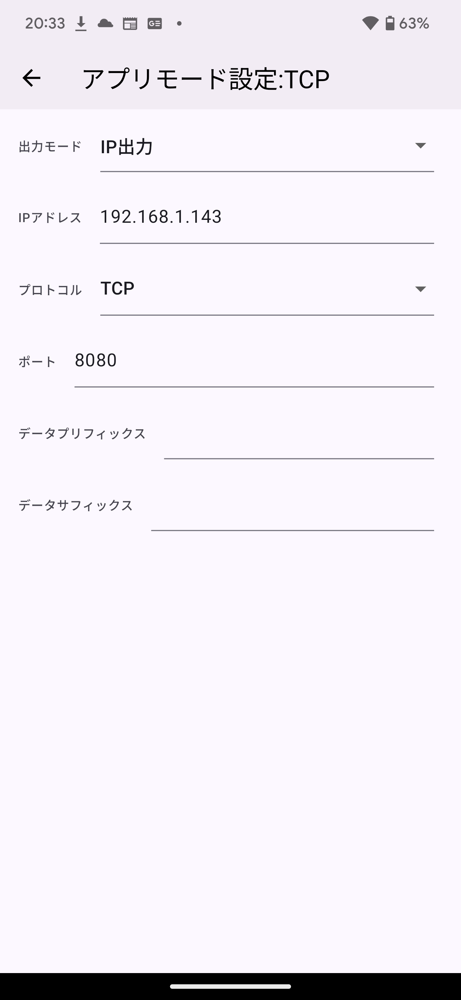
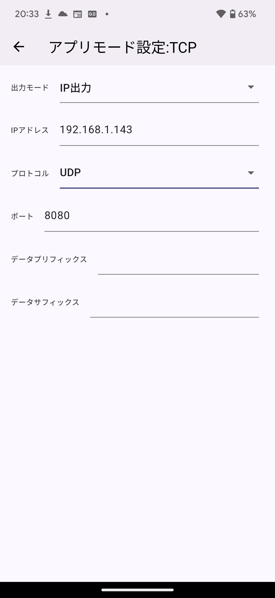
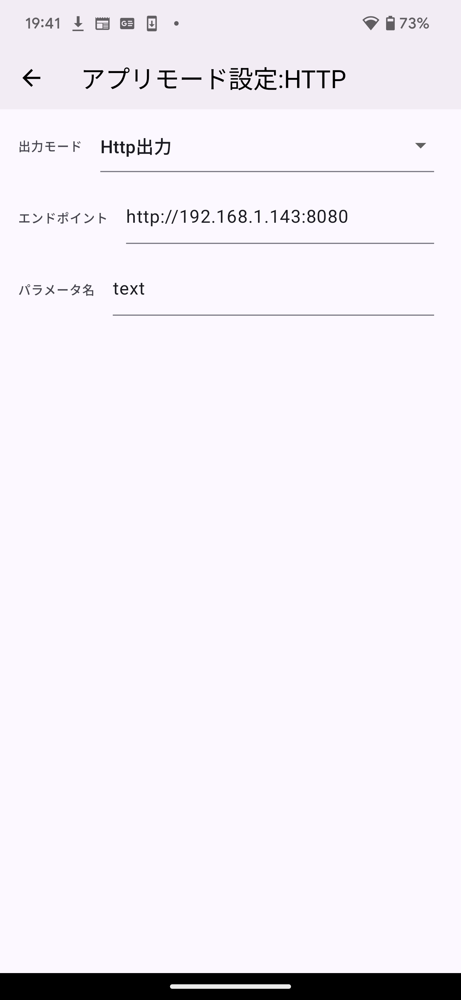

# EdgeOCR Receiver

[EdgeOCR APP](https://edge-ocr.com/app)から、ネットワーク越しにスキャン結果を受けとるサンプルアプリケーションです。
Windows環境での利用を想定してます。

## 利用方法

このリポジトリをダウンロード、もしくは`git clone`してください。

EdgeOCR APPの「出力モード」ごとに使用するプログラムが異なります。それぞれのパートをご覧ください。
またこのドキュメントを通して、プログラムを実行するパソコンのIPアドレスは`192.168.143`と想定します。

### IP出力の場合

### TCPの場合
`tcp-text-receiver/start.bat` をクリックすると、PowerShell で TCPサーバー（ポート 8080）が立ち上がり、EdgeOCR APPからのメッセージを受信します。

サーバーが立ち上がった状態で、EdgeOCR APPからスキャン結果を投げると、フォーカスの当たっている箇所にスキャン結果を入力します。

EdgeOCR APPの設定は下記画像を参考にしてください。

### UDPの場合

`udp-text-receiver/start.bat`をクリックすると、PowerShell で UDPサーバー（ポート 8080）が立ち上がり、EdgeOCR APPからのメッセージを受信します。

サーバーが立ち上がった状態で、EdgeOCR APPからスキャン結果を投げると、フォーカスの当たっている箇所にスキャン結果を入力します。

EdgeOCR APPの設定は下記画像を参考にしてください。

### Http出力の場合
Pythonを使用します。Python（3系）をインストールしていない場合は、事前にMicrosoft StoreなどでPythonをインストールしておいてください。

`http-text-receiver/pyserver.py`を使用します。エクスプローラーで、`pyserver.py`を右クリックし、「プログラムから開く」から、「Python 3.XX」を選択してください。XXは、インストールしたPythonのバージョンになります。

このプログラムは、ポート8080で待ち受けてます。
EdgeOCR APPに、プログラムを起動したパソコンのIPアドレスとポート8080を設定してください。
設定を行い実際にスキャンをすると、コマンドプロントにスキャン結果が表示されます。

設定方法は下記の画像を参考にしてください。

